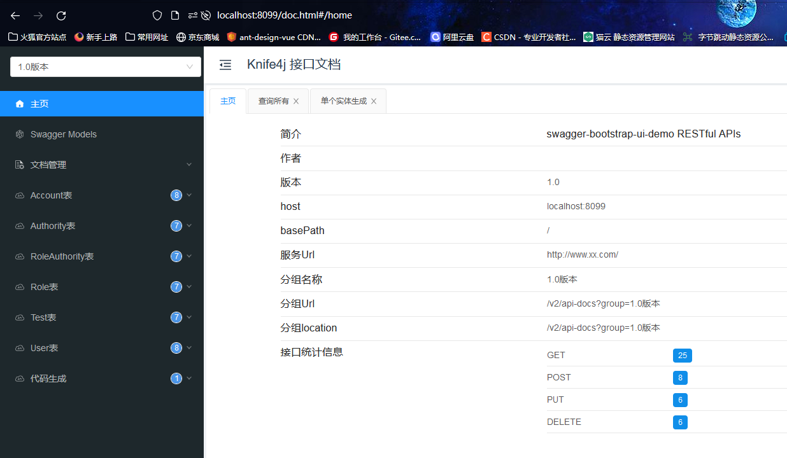

# SpringBootApi

#### 介绍
SpringBootApi快速开发框架，继承SpringBootApi+Vue3+Vite+TypeScript，高度封装，集成Admin管理后台，低代码量

#### 软件架构
软件架构说明
1. java 1.8
2. knife4j API接口文档
4. fluent mybatis 1.9 数据库操作框架
5. mysql
6. websocket即时通讯
7. 代码生成器，生成dao，service，controller
8. jwt
9. Pbkdf2加密
10. jpa实体类生成数据库
11. Vue3
12. Vite
13. TypeScript
14. 权限控制

#### 安装教程

1. 安装meven里面的所有包即可
2. 创建数据库springbootapi
3. 在application.yml里面配置spring:sql: init: mode: always，第一次初始化数据库，初始化成功后改为never，不然每次启动都会初始化数据库
4. 运行项目，访问http://localhost:8686/doc.html

#### 使用说明
1. 直接启动，默认端口8099，访问localhost:8099/doc.html打开api接口文档，如下图

2. 代码生成器，创建实体类后，在api接口文档中调用即可，entityName为实体类名，isCover是否覆盖

3. 数据库操作，请查看fluent mybatis文档 https://gitee.com/fluent-mybatis/fluent-mybatis-docs ,建议直接在service里面操作数据，通过mapper对象可以满足所有数据库操作，不要修改dao里面的代码
<<<<<<< HEAD
4. 开发环境
#开启接口文档
knife4j:
  # 开启生产环境屏蔽
  production: false
=======
4. web为后台代码，npm install 安装，npm run dev 启动localhost:4000,管理员账号admin，密码123456
>>>>>>> dev
